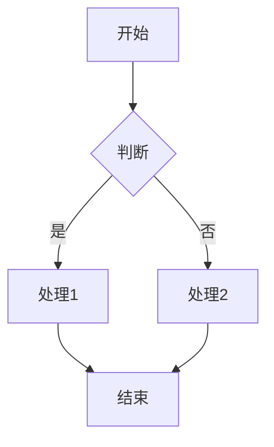

# Electron Markdown Editor - 测试用例文档

## 文档信息

| 项目 | 内容 |
|------|------|
| 文档版本 | v1.1.0 |
| 创建日期 | 2026-05-11 |
| 更新日期 | 2026-05-11 |
| 测试负责人 | 胡宇峰 |
| 开发者 | 胡宇峰 |
| 联系邮箱 | hyf2k@163.com |
| 审核状态 | 待审核 |

---

## 1. 测试策略概述

### 1.1 测试目标

确保 Electron Markdown Editor 的功能正确性、性能稳定性和安全性，提供高质量的用户体验。

### 1.2 测试范围

| 测试类型 | 覆盖范围 | 优先级 |
|---------|---------|--------|
| 单元测试 | 工具函数、状态管理、数据处理 | P0 |
| 集成测试 | 组件交互、IPC 通信、文件操作 | P0 |
| E2E 测试 | 完整用户流程、跨平台兼容性 | P1 |
| 性能测试 | 大文档处理、渲染性能、内存占用 | P1 |
| 安全测试 | XSS 防护、进程隔离、CSP | P0 |
| 兼容性测试 | 多平台、多版本 | P1 |

### 1.3 测试环境

| 环境 | 配置 |
|------|------|
| 开发环境 | macOS 14, Node.js 20.x, Electron 41.x |
| CI 环境 | Ubuntu 22.04, Windows Server 2022, macOS 13 |
| 测试设备 | Windows 11, macOS 14, Ubuntu 22.04 |

---

## 2. 单元测试用例

### 2.1 Markdown 处理模块

#### TC-MD-001: Markdown 解析基础功能

| 项目 | 内容 |
|------|------|
| **测试目的** | 验证 Markdown 基础语法解析正确 |
| **前置条件** | markdownProcessor 已初始化 |
| **测试数据** | `# 标题\n\n正文内容` |

**测试步骤**：
1. 调用 `parseMarkdown('# 标题\n\n正文内容')`
2. 检查返回的 HTML

**预期结果**：
```html
<h1>标题</h1>
<p>正文内容</p>
```

**自动化代码**：
```typescript
import { describe, it, expect } from 'vitest';
import { parseMarkdown } from '../utils/markdown';

describe('Markdown Parser', () => {
  it('should parse heading correctly', async () => {
    const result = await parseMarkdown('# 标题');
    expect(result).toContain('<h1>标题</h1>');
  });

  it('should parse paragraph correctly', async () => {
    const result = await parseMarkdown('正文内容');
    expect(result).toContain('<p>正文内容</p>');
  });

  it('should parse bold text correctly', async () => {
    const result = await parseMarkdown('**粗体**');
    expect(result).toContain('<strong>粗体</strong>');
  });

  it('should parse italic text correctly', async () => {
    const result = await parseMarkdown('*斜体*');
    expect(result).toContain('<em>斜体</em>');
  });

  it('should parse code block correctly', async () => {
    const result = await parseMarkdown('```js\nconst x = 1;\n```');
    expect(result).toContain('<pre>');
    expect(result).toContain('<code');
    expect(result).toContain('const x = 1;');
  });

  it('should parse list correctly', async () => {
    const result = await parseMarkdown('- 项目1\n- 项目2');
    expect(result).toContain('<ul>');
    expect(result).toContain('<li>项目1</li>');
    expect(result).toContain('<li>项目2</li>');
  });
});
```

---

#### TC-INT-005: 预览面板开关

| 项目 | 内容 |
|------|------|
| **测试目的** | 验证预览面板开关功能正常工作 |

**自动化代码**：
```typescript
test.describe('Preview Panel Toggle', () => {
  test('should toggle preview panel via button', async ({ page }) => {
    await page.goto('index.html');

    // 验证预览面板初始可见
    await expect(page.locator('.preview-pane')).toBeVisible();

    // 点击预览开关按钮
    await page.click('[data-testid="toggle-preview-btn"]');

    // 验证预览面板隐藏
    await expect(page.locator('.preview-pane')).not.toBeVisible();

    // 再次点击
    await page.click('[data-testid="toggle-preview-btn"]');

    // 验证预览面板重新显示
    await expect(page.locator('.preview-pane')).toBeVisible();
  });

  test('should toggle preview panel via shortcut', async ({ page }) => {
    await page.goto('index.html');

    // 使用快捷键 Ctrl+Shift+P
    await page.keyboard.press('Control+Shift+P');

    // 验证预览面板隐藏
    await expect(page.locator('.preview-pane')).not.toBeVisible();

    // 再次使用快捷键
    await page.keyboard.press('Control+Shift+P');

    // 验证预览面板重新显示
    await expect(page.locator('.preview-pane')).toBeVisible();
  });

  test('should persist preview visibility state', async ({ page }) => {
    await page.goto('index.html');

    // 隐藏预览面板
    await page.click('[data-testid="toggle-preview-btn"]');

    // 刷新页面
    await page.reload();

    // 验证预览面板保持隐藏状态
    await expect(page.locator('.preview-pane')).not.toBeVisible();
  });

  test('should expand editor when preview hidden', async ({ page }) => {
    await page.goto('index.html');

    // 获取编辑器初始宽度
    const initialWidth = await page.locator('.editor-pane').evaluate((el) => {
      return el.getBoundingClientRect().width;
    });

    // 隐藏预览面板
    await page.click('[data-testid="toggle-preview-btn"]');

    // 获取编辑器新宽度
    const newWidth = await page.locator('.editor-pane').evaluate((el) => {
      return el.getBoundingClientRect().width;
    });

    // 验证编辑器宽度增加
    expect(newWidth).toBeGreaterThan(initialWidth);
  });
});
```

---

#### TC-MD-002: 数学公式渲染

| 项目 | 内容 |
|------|------|
| **测试目的** | 验证 KaTeX 数学公式渲染正确 |
| **前置条件** | KaTeX 插件已启用 |
| **测试数据** | `$E=mc^2$` 和 `$$\sum_{i=1}^n x_i$$` |

**测试步骤**：
1. 解析行内公式 `$E=mc^2$`
2. 解析块级公式 `$$\sum_{i=1}^n x_i$$`

**预期结果**：
- 行内公式生成 `<span class="katex">...</span>`
- 块级公式生成 `<div class="katex-display">...</div>`

**自动化代码**：
```typescript
describe('Math Rendering', () => {
  it('should render inline math', async () => {
    const result = await parseMarkdown('$E=mc^2$');
    expect(result).toContain('katex');
    expect(result).toContain('E');
    expect(result).toContain('=');
  });

  it('should render block math', async () => {
    const result = await parseMarkdown('$$\\sum_{i=1}^n x_i$$');
    expect(result).toContain('katex-display');
  });

  it('should handle complex math expressions', async () => {
    const math = '$\\frac{a}{b} + \\sqrt{c}$';
    const result = await parseMarkdown(math);
    expect(result).toContain('katex');
  });
});
```

---

#### TC-MD-003: HTML 安全净化

| 项目 | 内容 |
|------|------|
| **测试目的** | 验证危险 HTML 被正确过滤 |
| **前置条件** | DOMPurify 和 rehype-sanitize 已启用 |
| **测试数据** | `<script>alert('xss')</script>` |

**测试步骤**：
1. 解析包含危险脚本的 Markdown
2. 检查输出 HTML

**预期结果**：
- `<script>` 标签被移除
- `onerror` 等事件处理器被移除
- `javascript:` 协议被移除

**自动化代码**：
```typescript
describe('HTML Sanitization', () => {
  it('should remove script tags', async () => {
    const result = await parseMarkdown('<script>alert("xss")</script>');
    expect(result).not.toContain('<script>');
    expect(result).not.toContain('alert');
  });

  it('should remove event handlers', async () => {
    const result = await parseMarkdown('');
    expect(result).not.toContain('onerror');
  });

  it('should remove javascript protocol', async () => {
    const result = await parseMarkdown('[link](javascript:alert(1))');
    expect(result).not.toContain('javascript:');
  });

  it('should allow safe HTML tags', async () => {
    const result = await parseMarkdown('<b>bold</b>');
    expect(result).toContain('<b>bold</b>');
  });
});
```

---

### 2.2 编码检测模块

#### TC-ENC-001: 编码自动检测

| 项目 | 内容 |
|------|------|
| **测试目的** | 验证编码检测准确性 |
| **前置条件** | jschardet 库已导入 |

**测试数据**：
| 文件内容 | 实际编码 | 预期检测结果 |
|---------|---------|-------------|
| Hello World | UTF-8 | UTF-8 |
| 你好世界 | UTF-8 | UTF-8 |
| 你好世界 | GBK | GBK |
| こんにちは | Shift-JIS | Shift-JIS |
| Café | ISO-8859-1 | ISO-8859-1 |

**自动化代码**：
```typescript
import { detectEncoding } from '../utils/encoding';
import iconv from 'iconv-lite';

describe('Encoding Detection', () => {
  it('should detect UTF-8 encoding', () => {
    const buffer = Buffer.from('Hello World', 'utf-8');
    const result = detectEncoding(buffer);
    expect(result).toBe('UTF-8');
  });

  it('should detect GBK encoding', () => {
    const buffer = iconv.encode('你好世界', 'gbk');
    const result = detectEncoding(buffer);
    expect(result.toLowerCase()).toContain('gb');
  });

  it('should detect Shift-JIS encoding', () => {
    const buffer = iconv.encode('こんにちは', 'shift_jis');
    const result = detectEncoding(buffer);
    expect(result.toLowerCase()).toContain('shift');
  });

  it('should default to UTF-8 for ASCII', () => {
    const buffer = Buffer.from('ASCII text', 'ascii');
    const result = detectEncoding(buffer);
    expect(result).toBeTruthy();
  });
});
```

---

### 2.3 状态管理模块

#### TC-STORE-001: Editor Store

| 项目 | 内容 |
|------|------|
| **测试目的** | 验证编辑器状态管理正确 |
| **前置条件** | Zustand store 已创建 |

**自动化代码**：
```typescript
import { useEditorStore } from '../stores/editorStore';

describe('Editor Store', () => {
  beforeEach(() => {
    useEditorStore.setState({
      content: '',
      cursorPosition: { line: 1, column: 1 },
      isDirty: false,
    });
  });

  it('should set content', () => {
    useEditorStore.getState().setContent('test content');
    expect(useEditorStore.getState().content).toBe('test content');
  });

  it('should mark as dirty when content changes', () => {
    useEditorStore.getState().setContent('new content');
    expect(useEditorStore.getState().isDirty).toBe(true);
  });

  it('should update cursor position', () => {
    useEditorStore.getState().setCursorPosition({ line: 5, column: 10 });
    expect(useEditorStore.getState().cursorPosition).toEqual({ line: 5, column: 10 });
  });

  it('should insert text', () => {
    useEditorStore.getState().setContent('Hello');
    useEditorStore.getState().insertText(' World', 5);
    expect(useEditorStore.getState().content).toBe('Hello World');
  });
});
```

---

#### TC-STORE-002: File Store

| 项目 | 内容 |
|------|------|
| **测试目的** | 验证文件状态管理正确 |

**自动化代码**：
```typescript
import { useFileStore } from '../stores/fileStore';

describe('File Store', () => {
  beforeEach(() => {
    useFileStore.setState({
      currentFile: null,
      fileTree: [],
      recentFiles: [],
      isLoading: false,
    });
  });

  it('should set current file', () => {
    const file = { path: '/test.md', name: 'test.md', content: 'test' };
    useFileStore.getState().setCurrentFile(file);
    expect(useFileStore.getState().currentFile).toEqual(file);
  });

  it('should add to recent files', () => {
    const file = { path: '/test.md', name: 'test.md' };
    useFileStore.getState().addRecentFile(file);
    expect(useFileStore.getState().recentFiles).toContainEqual(file);
  });

  it('should limit recent files to 10', () => {
    for (let i = 0; i < 15; i++) {
      useFileStore.getState().addRecentFile({ path: `/file${i}.md`, name: `file${i}.md` });
    }
    expect(useFileStore.getState().recentFiles.length).toBe(10);
  });
});
```

---

### 2.4 工具函数模块

#### TC-UTIL-001: 快捷键处理

| 项目 | 内容 |
|------|------|
| **测试目的** | 验证快捷键解析正确 |

**自动化代码**：
```typescript
import { parseShortcut, isShortcutMatch } from '../utils/shortcuts';

describe('Shortcuts', () => {
  it('should parse Ctrl+B', () => {
    const shortcut = parseShortcut('Ctrl+B');
    expect(shortcut.ctrl).toBe(true);
    expect(shortcut.key).toBe('b');
  });

  it('should parse Ctrl+Shift+K', () => {
    const shortcut = parseShortcut('Ctrl+Shift+K');
    expect(shortcut.ctrl).toBe(true);
    expect(shortcut.shift).toBe(true);
    expect(shortcut.key).toBe('k');
  });

  it('should match keyboard event', () => {
    const event = { ctrlKey: true, key: 'b' } as KeyboardEvent;
    expect(isShortcutMatch(event, 'Ctrl+B')).toBe(true);
  });

  it('should not match different shortcut', () => {
    const event = { ctrlKey: true, key: 'i' } as KeyboardEvent;
    expect(isShortcutMatch(event, 'Ctrl+B')).toBe(false);
  });
});
```

---

#### TC-UTIL-002: 防抖函数

| 项目 | 内容 |
|------|------|
| **测试目的** | 验证防抖功能正确 |

**自动化代码**：
```typescript
import { debounce } from '../utils/helpers';
import { vi } from 'vitest';

describe('Debounce', () => {
  beforeEach(() => {
    vi.useFakeTimers();
  });

  afterEach(() => {
    vi.useRealTimers();
  });

  it('should delay function execution', () => {
    const fn = vi.fn();
    const debouncedFn = debounce(fn, 300);

    debouncedFn();
    expect(fn).not.toHaveBeenCalled();

    vi.advanceTimersByTime(300);
    expect(fn).toHaveBeenCalledTimes(1);
  });

  it('should reset timer on multiple calls', () => {
    const fn = vi.fn();
    const debouncedFn = debounce(fn, 300);

    debouncedFn();
    vi.advanceTimersByTime(200);
    debouncedFn();
    vi.advanceTimersByTime(200);
    expect(fn).not.toHaveBeenCalled();

    vi.advanceTimersByTime(100);
    expect(fn).toHaveBeenCalledTimes(1);
  });
});
```

---

## 3. 集成测试用例

### 3.1 文件操作集成

#### TC-INT-001: 文件打开流程

| 项目 | 内容 |
|------|------|
| **测试目的** | 验证文件打开完整流程 |
| **前置条件** | Electron 应用已启动 |

**测试步骤**：
1. 点击"打开文件"按钮
2. 选择测试文件
3. 验证文件内容加载到编辑器
4. 验证文件路径显示在状态栏

**自动化代码**：
```typescript
import { test, expect } from '@playwright/test';

test.describe('File Operations', () => {
  test('should open file and load content', async ({ page }) => {
    // 启动应用
    await page.goto('index.html');

    // 模拟 IPC 响应
    await page.evaluate(() => {
      window.electronAPI = {
        files: {
          open: async () => ({
            path: '/test.md',
            content: '# Test\n\nContent',
            encoding: 'utf-8',
          }),
        },
      };
    });

    // 点击打开文件
    await page.click('[data-testid="open-file-btn"]');

    // 验证内容加载
    await expect(page.locator('.cm-content')).toContainText('# Test');
    await expect(page.locator('.cm-content')).toContainText('Content');
  });

  test('should save file', async ({ page }) => {
    let savedContent = '';

    await page.evaluate(() => {
      window.electronAPI = {
        files: {
          save: async (path: string, content: string) => {
            savedContent = content;
            return true;
          },
        },
      };
    });

    // 输入内容
    await page.fill('.cm-content', 'Test content');

    // 保存文件
    await page.keyboard.press('Control+s');

    // 验证保存
    expect(savedContent).toBe('Test content');
  });
});
```

---

### 3.2 编辑器集成

#### TC-INT-002: 工具栏按钮功能

| 项目 | 内容 |
|------|------|
| **测试目的** | 验证工具栏按钮正确插入 Markdown 语法 |

**自动化代码**：
```typescript
test.describe('Toolbar', () => {
  test('should insert bold syntax', async ({ page }) => {
    await page.goto('index.html');
    
    // 输入文本并选中
    await page.fill('.cm-content', 'text');
    await page.tripleClick('.cm-content');

    // 点击加粗按钮
    await page.click('[data-testid="bold-btn"]');

    // 验证语法插入
    await expect(page.locator('.cm-content')).toContainText('**text**');
  });

  test('should insert heading syntax', async ({ page }) => {
    await page.goto('index.html');
    
    await page.fill('.cm-content', 'Title');
    await page.tripleClick('.cm-content');

    // 点击 H1 按钮
    await page.click('[data-testid="h1-btn"]');

    await expect(page.locator('.cm-content')).toContainText('# Title');
  });

  test('should insert code block', async ({ page }) => {
    await page.goto('index.html');
    
    // 点击代码块按钮
    await page.click('[data-testid="code-block-btn"]');

    await expect(page.locator('.cm-content')).toContainText('```');
  });
});
```

---

#### TC-INT-003: 快捷键功能

| 项目 | 内容 |
|------|------|
| **测试目的** | 验证快捷键正常工作 |

**自动化代码**：
```typescript
test.describe('Keyboard Shortcuts', () => {
  test('Ctrl+B should make text bold', async ({ page }) => {
    await page.goto('index.html');
    
    await page.fill('.cm-content', 'text');
    await page.tripleClick('.cm-content');
    await page.keyboard.press('Control+b');

    await expect(page.locator('.cm-content')).toContainText('**text**');
  });

  test('Ctrl+S should save file', async ({ page }) => {
    let saveCalled = false;

    await page.evaluate(() => {
      window.electronAPI = {
        files: {
          save: async () => {
            saveCalled = true;
            return true;
          },
        },
      };
    });

    await page.keyboard.press('Control+s');

    expect(saveCalled).toBe(true);
  });

  test('Ctrl+1 should insert H1', async ({ page }) => {
    await page.goto('index.html');
    
    await page.fill('.cm-content', 'Title');
    await page.tripleClick('.cm-content');
    await page.keyboard.press('Control+1');

    await expect(page.locator('.cm-content')).toContainText('# Title');
  });
});
```

---

### 3.3 预览集成

#### TC-INT-004: 实时预览更新

| 项目 | 内容 |
|------|------|
| **测试目的** | 验证编辑内容实时同步到预览区 |

**自动化代码**：
```typescript
test.describe('Live Preview', () => {
  test('should update preview after typing', async ({ page }) => {
    await page.goto('index.html');

    // 输入 Markdown
    await page.fill('.cm-content', '# Hello');

    // 等待防抖
    await page.waitForTimeout(350);

    // 验证预览更新
    await expect(page.locator('.preview-content h1')).toHaveText('Hello');
  });

  test('should render math formula in preview', async ({ page }) => {
    await page.goto('index.html');

    await page.fill('.cm-content', '$E=mc^2$');
    await page.waitForTimeout(350);

    // 验证 KaTeX 渲染
    await expect(page.locator('.preview-content .katex')).toBeVisible();
  });

  test('should render code highlighting', async ({ page }) => {
    await page.goto('index.html');

    await page.fill('.cm-content', '```js\nconst x = 1;\n```');
    await page.waitForTimeout(350);

    // 验证代码高亮
    await expect(page.locator('.preview-content pre code')).toHaveClass(/hljs/);
  });
});
```

---

## 4. E2E 测试用例

### 4.1 完整用户流程

#### TC-E2E-001: 新建文档并导出

| 项目 | 内容 |
|------|------|
| **测试目的** | 验证完整的新建-编辑-导出流程 |

**测试步骤**：
1. 打开应用
2. 输入 Markdown 内容（包含标题、列表、代码块、公式）
3. 使用工具栏格式化文本
4. 导出为 HTML
5. 验证导出文件内容正确

**自动化代码**：
```typescript
import { test, expect } from '@playwright/test';
import path from 'path';
import fs from 'fs';

test.describe('End-to-End Workflows', () => {
  test('complete document workflow', async ({ page }) => {
    await page.goto('index.html');

    // 输入文档内容
    const content = `# Project Documentation

## Introduction
This is a test document.

## Features
- Feature 1
- Feature 2

## Code Example
\`\`\`typescript
const greeting = "Hello World";
console.log(greeting);
\`\`\`

## Formula
The famous equation: $E=mc^2$
`;

    await page.fill('.cm-content', content);
    await page.waitForTimeout(350);

    // 验证预览渲染
    await expect(page.locator('.preview-content h1')).toHaveText('Project Documentation');
    await expect(page.locator('.preview-content h2')).toHaveCount(3);
    await expect(page.locator('.preview-content ul li')).toHaveCount(2);
    await expect(page.locator('.preview-content pre')).toBeVisible();
    await expect(page.locator('.preview-content .katex')).toBeVisible();

    // 导出 HTML
    const downloadPromise = page.waitForEvent('download');
    await page.click('[data-testid="export-html-btn"]');
    const download = await downloadPromise;

    // 验证导出文件
    const downloadPath = await download.path();
    expect(downloadPath).toBeTruthy();
    
    const fileContent = fs.readFileSync(downloadPath!, 'utf-8');
    expect(fileContent).toContain('Project Documentation');
    expect(fileContent).toContain('E=mc');
  });
});
```

---

#### TC-E2E-002: 文件管理流程

| 项目 | 内容 |
|------|------|
| **测试目的** | 验证文件树浏览和文件切换 |

**自动化代码**：
```typescript
test.describe('File Management', () => {
  test('browse and open files from directory', async ({ page }) => {
    await page.goto('index.html');

    // 模拟目录结构
    await page.evaluate(() => {
      window.electronAPI = {
        files: {
          readDirectory: async () => [
            { name: 'docs', type: 'directory', path: '/docs' },
            { name: 'readme.md', type: 'file', path: '/readme.md' },
            { name: 'guide.md', type: 'file', path: '/guide.md' },
          ],
          open: async () => ({
            path: '/readme.md',
            content: '# README\n\nProject readme content',
            encoding: 'utf-8',
          }),
        },
      };
    });

    // 展开目录
    await page.click('[data-testid="file-tree-toggle"]');

    // 验证文件树显示
    await expect(page.locator('[data-testid="file-tree"]')).toContainText('docs');
    await expect(page.locator('[data-testid="file-tree"]')).toContainText('readme.md');

    // 点击文件打开
    await page.click('text=readme.md');

    // 验证文件内容加载
    await expect(page.locator('.cm-content')).toContainText('README');
  });
});
```

---

### 4.2 跨平台测试

#### TC-E2E-003: 多平台兼容性

| 项目 | 内容 |
|------|------|
| **测试目的** | 验证应用在不同平台正常工作 |

**测试矩阵**：

| 平台 | 版本 | 测试内容 |
|------|------|---------|
| Windows | 10/11 | 安装、基本功能、快捷键 |
| macOS | 12/13/14 | 安装、基本功能、快捷键 |
| Linux | Ubuntu 22.04 | 安装、基本功能、快捷键 |

---

## 5. 性能测试用例

### 5.1 大文档处理

#### TC-PERF-001: 大文件打开性能

| 项目 | 内容 |
|------|------|
| **测试目的** | 验证大文件打开性能符合要求 |
| **测试数据** | 1MB Markdown 文件（约 50,000 字） |
| **目标值** | 打开时间 < 500ms |

**自动化代码**：
```typescript
import { test, expect } from '@playwright/test';

test.describe('Performance Tests', () => {
  test('should open large file within 500ms', async ({ page }) => {
    await page.goto('index.html');

    // 生成大文件内容
    const largeContent = '# Large Document\n\n' + 
      Array(10000).fill('Lorem ipsum dolor sit amet.').join('\n\n');

    await page.evaluate((content) => {
      window.electronAPI = {
        files: {
          open: async () => ({
            path: '/large.md',
            content,
            encoding: 'utf-8',
          }),
        },
      };
    }, largeContent);

    const startTime = Date.now();
    await page.click('[data-testid="open-file-btn"]');
    await page.waitForSelector('.cm-content');
    const endTime = Date.now();

    const loadTime = endTime - startTime;
    expect(loadTime).toBeLessThan(500);
  });

  test('should render preview within 500ms', async ({ page }) => {
    await page.goto('index.html');

    const content = Array(1000).fill('# Heading\n\nParagraph content.').join('\n\n');

    const startTime = Date.now();
    await page.fill('.cm-content', content);
    await page.waitForTimeout(350); // 等待防抖
    await page.waitForSelector('.preview-content h1');
    const endTime = Date.now();

    const renderTime = endTime - startTime;
    expect(renderTime).toBeLessThan(500);
  });
});
```

---

#### TC-PERF-002: 内存占用测试

| 项目 | 内容 |
|------|------|
| **测试目的** | 验证内存占用符合要求 |
| **目标值** | 正常使用 < 500MB |

**自动化代码**：
```typescript
test('memory usage should be under 500MB', async ({ page }) => {
  await page.goto('index.html');

  // 获取初始内存
  const initialMetrics = await page.evaluate(() => {
    return (performance as any).memory?.usedJSHeapSize || 0;
  });

  // 加载大文件
  const largeContent = Array(10000).fill('Content').join('\n\n');
  await page.fill('.cm-content', largeContent);
  await page.waitForTimeout(350);

  // 获取加载后内存
  const finalMetrics = await page.evaluate(() => {
    return (performance as any).memory?.usedJSHeapSize || 0;
  });

  const memoryIncrease = (finalMetrics - initialMetrics) / 1024 / 1024; // MB
  expect(memoryIncrease).toBeLessThan(500);
});
```

---

## 6. 安全测试用例

### 6.1 XSS 防护测试

#### TC-SEC-001: XSS 攻击防护

| 项目 | 内容 |
|------|------|
| **测试目的** | 验证 XSS 攻击被有效防护 |

**测试数据**：
```javascript
// 测试用例 1: 脚本标签
<script>alert('XSS')</script>

// 测试用例 2: 事件处理器


// 测试用例 3: JavaScript 协议
[link](javascript:alert('XSS'))

// 测试用例 4: HTML 实体
&lt;script&gt;alert('XSS')&lt;/script&gt;

// 测试用例 5: 数据 URI
<iframe src="data:text/html,<script>alert('XSS')</script>">
```

**自动化代码**：
```typescript
test.describe('Security Tests', () => {
  test('should prevent script tag injection', async ({ page }) => {
    await page.goto('index.html');

    await page.fill('.cm-content', '<script>alert("XSS")</script>');
    await page.waitForTimeout(350);

    const previewHTML = await page.locator('.preview-content').innerHTML();
    expect(previewHTML).not.toContain('<script>');
    expect(previewHTML).not.toContain('alert');
  });

  test('should prevent event handler injection', async ({ page }) => {
    await page.goto('index.html');

    await page.fill('.cm-content', '');
    await page.waitForTimeout(350);

    const previewHTML = await page.locator('.preview-content').innerHTML();
    expect(previewHTML).not.toContain('onerror');
  });

  test('should prevent javascript protocol', async ({ page }) => {
    await page.goto('index.html');

    await page.fill('.cm-content', '[link](javascript:alert(1))');
    await page.waitForTimeout(350);

    const previewHTML = await page.locator('.preview-content').innerHTML();
    expect(previewHTML).not.toContain('javascript:');
  });

  test('should allow safe HTML tags', async ({ page }) => {
    await page.goto('index.html');

    await page.fill('.cm-content', '<b>Bold</b> and <i>Italic</i>');
    await page.waitForTimeout(350);

    const previewHTML = await page.locator('.preview-content').innerHTML();
    expect(previewHTML).toContain('<b>Bold</b>');
    expect(previewHTML).toContain('<i>Italic</i>');
  });
});
```

---

### 6.2 进程隔离测试

#### TC-SEC-002: 进程安全验证

| 项目 | 内容 |
|------|------|
| **测试目的** | 验证渲染进程无法访问 Node.js API |

**自动化代码**：
```typescript
test('renderer should not have access to Node.js API', async ({ page }) => {
  await page.goto('index.html');

  const hasNodeAccess = await page.evaluate(() => {
    return typeof process !== 'undefined' || 
           typeof require !== 'undefined' ||
           typeof module !== 'undefined';
  });

  expect(hasNodeAccess).toBe(false);
});

test('renderer should not access file system directly', async ({ page }) => {
  await page.goto('index.html');

  const canAccessFS = await page.evaluate(() => {
    try {
      // @ts-ignore
      return typeof fs !== 'undefined' || 
             typeof window.fs !== 'undefined';
    } catch {
      return false;
    }
  });

  expect(canAccessFS).toBe(false);
});
```

---

## 7. 测试执行计划

### 7.1 测试阶段

| 阶段 | 时间 | 测试类型 | 执行者 |
|------|------|---------|--------|
| 开发阶段 | 持续 | 单元测试 | 开发者 |
| 功能完成 | 每功能 | 集成测试 | 测试工程师 |
| 迭代结束 | 每迭代 | E2E 测试 | 测试工程师 |
| 发布前 | 发布前 | 全量测试 | 测试团队 |

### 7.2 测试环境配置

```bash
# 安装测试依赖
pnpm add -D vitest @playwright/test

# 运行单元测试
pnpm test:unit

# 运行集成测试
pnpm test:integration

# 运行 E2E 测试
pnpm test:e2e

# 运行所有测试
pnpm test

# 生成测试报告
pnpm test:coverage
```

### 7.3 CI/CD 集成

```yaml
# .github/workflows/test.yml
name: Test

on: [push, pull_request]

jobs:
  test:
    runs-on: ${{ matrix.os }}
    strategy:
      matrix:
        os: [ubuntu-latest, windows-latest, macos-latest]

    steps:
      - uses: actions/checkout@v3
      
      - name: Setup Node.js
        uses: actions/setup-node@v3
        with:
          node-version: '20'

      - name: Install pnpm
        uses: pnpm/action-setup@v2
        with:
          version: 9

      - name: Install dependencies
        run: pnpm install

      - name: Run type check
        run: pnpm typecheck

      - name: Run lint
        run: pnpm lint

      - name: Run unit tests
        run: pnpm test:unit --coverage

      - name: Run E2E tests
        run: pnpm test:e2e

      - name: Upload coverage
        uses: codecov/codecov-action@v3
```

---

## 8. 测试报告模板

### 8.1 测试执行报告

```markdown
# 测试执行报告

## 执行信息
- 执行日期: 2026-XX-XX
- 执行人: XXX
- 版本: v0.1.0-alpha
- 环境: macOS 14, Node.js 20.x

## 执行结果
| 测试类型 | 用例数 | 通过 | 失败 | 跳过 | 通过率 |
|---------|-------|------|------|------|--------|
| 单元测试 | 50 | 50 | 0 | 0 | 100% |
| 集成测试 | 30 | 29 | 1 | 0 | 96.7% |
| E2E 测试 | 20 | 18 | 2 | 0 | 90% |
| **总计** | **100** | **97** | **3** | **0** | **97%** |

## 缺陷列表
| ID | 描述 | 严重程度 | 状态 |
|---|------|---------|------|
| BUG-001 | XXX | 高 | 待修复 |

## 结论
[测试结论和建议]
```

---

## 9. 附录

### 9.1 测试数据

#### 示例 Markdown 文件

```markdown
# 测试文档

## 基础格式

**粗体文本** 和 *斜体文本* 和 ~~删除线~~

## 列表

### 无序列表
- 项目 1
- 项目 2
  - 子项目 2.1
  - 子项目 2.2
- 项目 3

### 有序列表
1. 第一步
2. 第二步
3. 第三步

## 代码

行内代码 `const x = 1`

代码块：
```typescript
function greet(name: string): string {
  return `Hello, ${name}!`;
}
```

## 表格

| 姓名 | 年龄 | 城市 |
|------|------|------|
| 张三 | 25 | 北京 |
| 李四 | 30 | 上海 |

## 数学公式

行内公式: $E=mc^2$

块级公式:
$$
\sum_{i=1}^{n} x_i = x_1 + x_2 + \cdots + x_n
$$

## 图表



## 链接和图片

[GitHub](https://github.com)


```

### 9.2 参考文档

- [Vitest 文档](https://vitest.dev/)
- [Playwright 文档](https://playwright.dev/)
- [Electron 测试指南](https://www.electronjs.org/docs/latest/tutorial/automated-testing)

---

**文档维护记录**

| 版本 | 日期 | 修改内容 | 作者 |
|------|------|---------|------|
| v1.0.0 | 2026-05-11 | 初始版本 | 胡宇峰 |
| v1.1.0 | 2026-05-11 | 增加预览面板开关测试用例 | 胡宇峰 |
